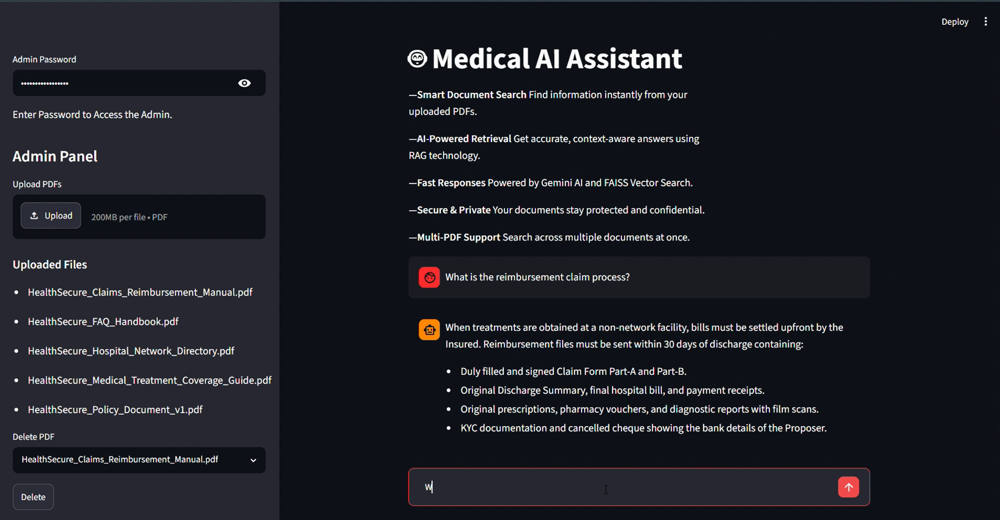

# 🏥 Medical Insurance RAG Chatbot

An AI-powered Retrieval-Augmented Generation (RAG) chatbot that allows users to upload medical insurance documents and ask questions in natural language. The system retrieves relevant information from uploaded PDFs using semantic search and generates accurate responses using Google Gemini.

---

## 🚀 Features

* 📄 Multi-PDF Upload Support
* 🔐 Password-Protected Admin Panel
* 🗑️ Upload & Delete Documents
* 🧩 Intelligent Document Chunking
* 🔍 Semantic Search using FAISS
* 🤖 Google Gemini Integration
* 🧠 Hugging Face Embeddings
* 💬 Interactive Chat Interface
* 📚 Chat History Support
* 🛡️ Medical Safety Guardrails

---

## 🛠️ Tech Stack

### Frontend

* Streamlit

### AI & LLM

* Google Gemini 2.5 Flash
* LangChain

### Vector Database

* FAISS

### Embeddings

* Hugging Face Embeddings
* all-MiniLM-L6-v2

### Document Processing

* PyPDFLoader
* RecursiveCharacterTextSplitter

### Backend

* Python

---

## ⚙️ System Architecture

PDF Documents
↓
PyPDFLoader
↓
Text Chunking
↓
Hugging Face Embeddings
↓
FAISS Vector Store
↓
Retriever
↓
LangChain Prompt
↓
Google Gemini
↓
AI Response

---

## 💡 Example Questions

* What is the reimbursement claim process?
* What documents are required for claim approval?
* Which treatments are covered under the policy?
* What are the common reasons for claim rejection?
* What is the waiting period for pre-existing diseases?

---

## 🛡️ Medical Safety

The chatbot does not provide medical diagnosis, treatment recommendations, or medication advice.

For medical concerns, users are advised to consult a qualified healthcare professional.

---

## 📂 Project Structure

```bash
Medical-Insurance-RAG/
│
├── app.py
├── faiss_index/
├── .env
├── requirements.txt
└── README.md
```

## 🔑 Environment Variables

Create a `.env` file:

```env
GOOGLE_API_KEY=your_google_api_key
ADMIN_PASSWORD=your_admin_password
```

---

## ▶️ Installation

Clone the repository:

```bash
git clone https://github.com/yourusername/Medical-Insurance-RAG.git
```

Install dependencies:

```bash
pip install -r requirements.txt
```

Run the application:

```bash
streamlit run app.py
```

---

## 📸 Demo



---

## 👨‍💻 Author

Jainesh Sanghavi

BCA Student | AI & Machine Learning Enthusiast

Passionate about Data Analytics, Machine Learning, Generative AI, and Enterprise AI Applications.
